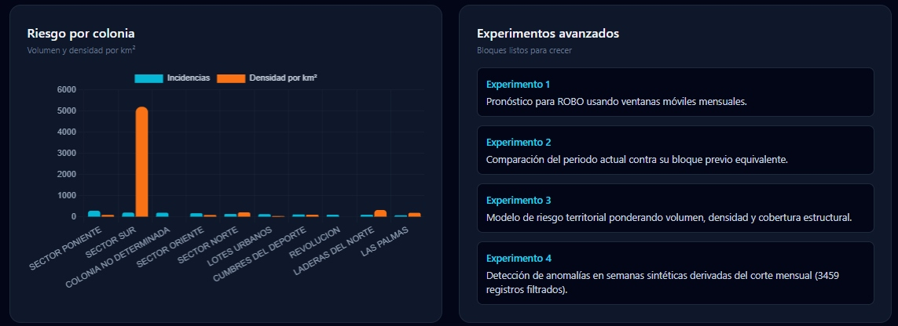
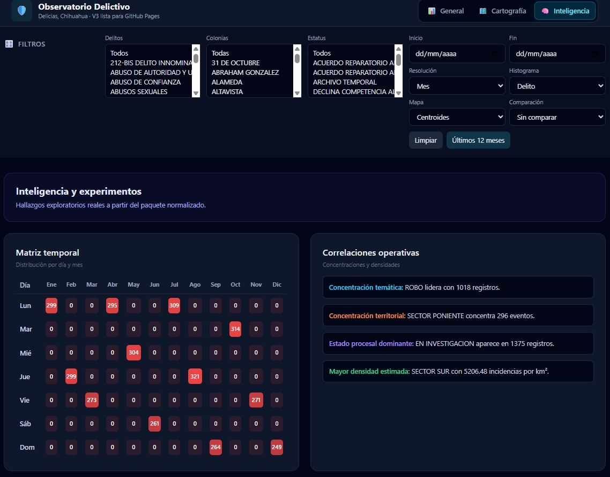
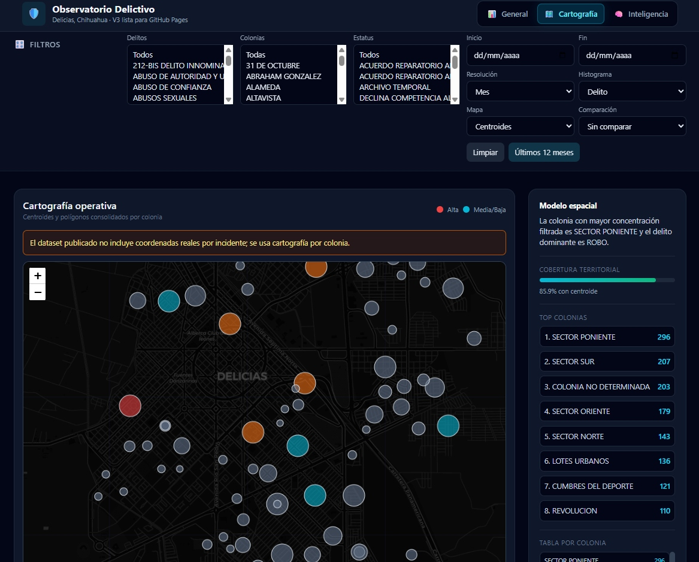
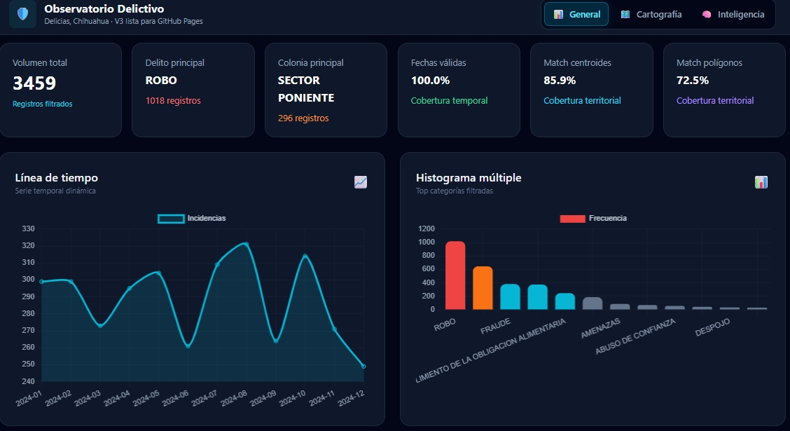

# Observatorio Delictivo de Delicias, Chihuahua

## Descripción

Desarrollé este tablero como una iniciativa orientada a transformar datos dispersos en un sistema de información delictiva útil, visual y accionable para Delicias, Chihuahua. Mi propósito fue construir una herramienta que no solo mostrara registros, sino que ayudara a observar patrones, concentraciones territoriales, tendencias temporales y elementos básicos para una prevención más inteligente del delito.

Partí de una problemática concreta: la falta de sistemas locales accesibles, integrados y comprensibles para la atención, el seguimiento estadístico y la prevención basada en evidencia. En muchos contextos municipales, la información existe, pero está fragmentada, sin normalización, con inconsistencias territoriales o en formatos que dificultan convertirla en decisiones operativas. Por eso diseñé este observatorio como un tablero web estático, portable y publicable, capaz de ejecutarse incluso en GitHub Pages sin depender de un backend complejo.

---

## Problema que busqué resolver

En Delicias, Chihuahua, uno de los principales retos para fortalecer la seguridad pública y la inteligencia institucional es no contar con sistemas de información delictiva integrados, estandarizados y orientados al análisis. Cuando los datos no están consolidados, el seguimiento de carpetas, la lectura territorial del fenómeno y la identificación de patrones de riesgo se vuelven lentos, manuales y poco consistentes.

Con este proyecto busqué resolver esa brecha mediante un tablero que permitiera:

- concentrar información en un solo punto,
- facilitar el análisis temporal y territorial,
- mejorar la interpretación estadística de las incidencias,
- sentar una base para decisiones de atención y seguimiento,
- habilitar una lógica de prevención inteligente basada en evidencia,
- y demostrar que es posible construir infraestructura analítica útil con herramientas web ligeras y datos públicos o institucionales ya existentes.

---

## Objetivos del proyecto

### Objetivo general

Construir un tablero interactivo de observación delictiva para Delicias, Chihuahua, que integrara datos de incidencia, referencia territorial y análisis visual en una sola plataforma web para apoyar la atención, el seguimiento estadístico y la prevención inteligente del delito.

### Objetivos específicos

- Integrar registros delictivos en un formato normalizado y consultable.
- Relacionar incidencias con colonias, centroides y polígonos territoriales.
- Generar visualizaciones temporales, histogramas, comparativas y cartografía operativa.
- Identificar colonias con mayor concentración y densidad estimada de incidencias.
- Mejorar la calidad del dato mediante limpieza, deduplicación y homologación.
- Publicar un producto funcional en formato estático para facilitar su despliegue y mantenimiento.

---

## Arquitectura del desarrollo

Diseñé la solución final como una aplicación web estática basada en `HTML`, `CSS` y `JavaScript`, con una interfaz estilizada mediante `Tailwind CSS`, visualización cartográfica con `Leaflet` y analítica gráfica con `Chart.js`. Esta decisión me permitió construir un producto ligero, fácilmente desplegable y compatible con GitHub Pages.

Antes de llegar a la versión final, también trabajé sobre una propuesta inicial en `React`, con componentes, estados, filtros y visualizaciones construidas sobre una estructura más cercana a un prototipo de aplicación SPA. Esa base sirvió para explorar flujos de datos, interacciones del tablero y criterios de interfaz antes de consolidar una versión más robusta y portable como sitio estático.

### Lenguajes utilizados

- HTML5
- CSS3
- JavaScript
- JSON
- Markdown

### Librerías y paquetes utilizados

- Tailwind CSS, para construir una interfaz moderna, responsiva y de rápida iteración.
- Leaflet, para representar la cartografía territorial y los elementos espaciales de colonias.
- Chart.js, para graficar series temporales, histogramas y comparaciones.
- Recharts, usado en la propuesta inicial del tablero desarrollada en React.
- Lucide React, usado en la propuesta inicial para iconografía del prototipo.

---

## Fuentes de información integradas

Para construir el tablero integré tres componentes de información complementarios:

1. Un conjunto principal de incidencias delictivas con campos como folio, mes de alta, año, delito, modalidad estadística, resolución, colonia y un campo WKT territorial asociado.
2. Un archivo territorial con geometrías WKT por colonia, utilizado para construir la capa espacial de polígonos.
3. Un archivo de centroides con latitud, longitud y nombre de colonia, utilizado para representar ubicaciones resumidas por territorio.

La integración de estas fuentes fue necesaria porque el conjunto principal de incidencias no incluía coordenadas puntuales reales por incidente. En consecuencia, la cartografía operativa de la solución final se estructuró a nivel colonia, usando centroides y polígonos como soporte territorial válido.

---

## Proceso de desarrollo

### 1. Exploración del prototipo

Inicié con una propuesta de tablero en React orientada a validar la experiencia de usuario, la organización por pestañas, los filtros principales y la lectura general de datos. Esa primera aproximación incluía módulos de análisis general, cartografía e inteligencia, y me permitió reconocer rápidamente limitaciones reales de la fuente de datos.

### 2. Evaluación de la estructura de datos

Durante la revisión del origen detecté que la fuente principal contenía mes y año de alta, colonia, delito, modalidad y resolución, pero no una fecha diaria completa ni coordenadas reales de cada evento. También observé que el WKT no correspondía a un punto individual por incidencia, sino a referencias territoriales de colonia.

### 3. Normalización y limpieza

A partir de ese hallazgo desarrollé una etapa de limpieza para corregir problemas de codificación, normalizar nombres de colonias, estandarizar textos, reconstruir fechas válidas a nivel mensual y homogenizar campos clave para análisis. Esta fase fue crítica para evitar errores de visualización, filtrado y agregación.

### 4. Integración territorial

Posteriormente integré los polígonos territoriales desde WKT hacia GeoJSON y los centroides desde su archivo JSON, con el objetivo de disponer de capas espaciales compatibles con el navegador. También dedupliqué registros territoriales para reducir inconsistencias derivadas de nombres repetidos o geometrías múltiples por la misma colonia.

### 5. Rediseño para publicación estable

Después del prototipo, opté por una arquitectura final más estable basada en archivos estáticos locales. Esta decisión respondió a una razón práctica: un tablero publicable en GitHub Pages debía minimizar dependencias de ejecución y evitar parseos costosos o frágiles en tiempo real.

### 6. Construcción de la versión V3

La versión V3 consolidó el resultado final del proceso. En esta etapa dejé integrada una estructura con catálogo maestro de colonias, incidencias normalizadas, centroides deduplicados, polígonos consolidados, validaciones de cobertura y desactivación automática del modo de puntos reales cuando la fuente no aporta coordenadas reales por evento.

---

## Integración y transformación de datos

El trabajo de integración consistió en convertir información heterogénea en una estructura analítica coherente. Para ello realicé tareas como normalización de texto, resolución de errores de codificación, deduplicación por colonia, reconstrucción temporal y conversión de geometrías a formatos consumibles por la interfaz web.

Los archivos finales del tablero quedaron organizados de la siguiente manera:

- `index.html`: interfaz principal del observatorio.
- `incidencias-normalizadas.json`: dataset limpio y preparado para filtros y análisis.
- `colonias.geojson`: capa territorial consolidada por colonia.
- `centroides-normalizados.json`: puntos resumen por colonia.
- `quality-report.json`: reporte de calidad y cobertura estructural.
- `catalogo-colonias.json`: catálogo maestro con incidencias, cobertura y densidad estimada.

Esta estructura hace posible que el tablero funcione sin servidor de aplicaciones, lo que facilita su publicación, respaldo, versionado y reutilización.

---

## ¿Por qué elegí esta solución?

Elegí una solución web estática porque necesitaba un producto sencillo de desplegar, económico de mantener y suficientemente robusto para compartir resultados sin infraestructura adicional. En un contexto municipal o institucional, esta decisión reduce barreras técnicas y acelera la posibilidad de adopción.

También prioricé una arquitectura centrada en archivos JSON porque favorece la transparencia del dato, simplifica la inspección de la información y hace más directo el proceso de auditoría y mejora continua. Desde una perspectiva de ciencia de datos aplicada, era más importante garantizar consistencia, trazabilidad y legibilidad que introducir complejidad innecesaria.

---

## Capacidades del tablero

El tablero final permite:

- visualizar volumen total de registros filtrados,
- identificar delitos y colonias de mayor concentración,
- analizar tendencias temporales,
- comparar periodos,
- observar cobertura territorial,
- representar incidencias por centroides y polígonos,
- estimar densidad por colonia,
- y explorar módulos de inteligencia y experimentación analítica.

La interfaz está organizada en tres grandes módulos:

- **General**, para KPIs, series de tiempo, histogramas y comparativas.
- **Cartografía**, para lectura espacial por colonia.
- **Inteligencia**, para matrices temporales, correlaciones y experimentos exploratorios.

---

## Calidad y consistencia de la información

Uno de los aprendizajes más importantes del desarrollo fue entender que un tablero no depende solo de su diseño, sino de la calidad estructural de sus datos. Por ello incorporé una lógica de control que verifica cobertura de fechas, coincidencia con centroides, coincidencia con polígonos y disponibilidad real de coordenadas puntuales.

La versión V3 quedó construida sobre 3,459 registros normalizados. Además, el paquete final identifica colonias únicas presentes en incidencias, colonias con cobertura de centroide y colonias con cobertura poligonal, lo que permite transparentar las fortalezas y limitaciones del sistema tal como existe hoy.

---

## Alcances y limitaciones

Este tablero no sustituye un sistema institucional completo de gestión del delito, pero sí construye una base funcional de observación, análisis y publicación. Su principal valor está en convertir información dispersa en una plataforma entendible y utilizable para análisis local.

La principal limitación actual es que la fuente de incidencias no incluye coordenadas puntuales reales por evento, por lo que la lectura espacial se realiza por colonia y no por ubicación exacta del incidente. Aun así, el observatorio conserva valor analítico para identificar concentración territorial, patrones temporales y prioridades de atención.

---

## Impacto esperado

Mi intención con este proyecto es aportar una herramienta que ayude a fortalecer capacidades locales de análisis delictivo y cultura de datos en Delicias, Chihuahua. Un observatorio como este puede servir como punto de partida para mejorar reportes institucionales, enriquecer la planeación territorial y orientar acciones preventivas más focalizadas.

También puede funcionar como base para futuras integraciones con fuentes más completas, como datos georreferenciados, series históricas multianuales, variables sociodemográficas, reportes operativos o indicadores de desempeño institucional. En ese sentido, el tablero no es un producto cerrado, sino una plataforma inicial de inteligencia pública basada en evidencia.

---

## Estructura del repositorio

```text
.
├── index.html
├── incidencias-normalizadas.json
├── colonias.geojson
├── centroides-normalizados.json
├── quality-report.json
├── catalogo-colonias.json
└── README.md
```
---

## Capturas del tablero

Las siguientes capturas deben colocarse en la raíz del proyecto, en el mismo nivel que `README.md`, `index.html` y los archivos JSON del tablero.

### image.jpg



En esta captura se puede visualizar una parte del módulo de **Inteligencia**, específicamente el gráfico **Riesgo por colonia** y el panel de **Experimentos avanzados**.  
El gráfico permite observar la comparación entre volumen de incidencias y densidad estimada por km² en distintas colonias, lo que ayuda a identificar territorios con mayor presión delictiva relativa.  
En la sección de experimentos avanzados se muestran bloques conceptuales para futuras extensiones analíticas, como pronóstico por ventanas móviles, comparación temporal, riesgo territorial ponderado y detección de anomalías.

### image-3.jpg



En esta imagen se observa de forma más completa el módulo de **Inteligencia y experimentos**.  
Es posible visualizar la barra superior de filtros, la segmentación por pestañas del sistema y dos componentes centrales: la **Matriz temporal** y el panel de **Correlaciones operativas**.  
La matriz temporal permite identificar concentraciones por día y mes, mientras que el panel de correlaciones resume hallazgos relevantes como concentración temática, concentración territorial, estado procesal dominante y mayor densidad estimada.

### image-4.jpg


Esta captura corresponde al módulo de **Cartografía operativa**.  
Aquí se puede visualizar el mapa del observatorio con representación espacial por colonia, el aviso sobre la ausencia de coordenadas reales por incidente, la cobertura territorial, el ranking de colonias con mayor concentración y una tabla lateral de apoyo analítico.  
Esta vista es clave porque traduce la incidencia delictiva a lectura territorial y facilita identificar patrones geográficos, zonas prioritarias y distribución espacial del fenómeno.

### image-5.jpg



En esta imagen se presenta una parte del módulo **General**, enfocada en la **Comparación temporal** y el bloque de **Calidad y estructura**.  
La comparación temporal permite contrastar el periodo actual frente a un periodo previo equivalente, mientras que el panel de calidad resume cobertura de fechas válidas, coincidencia con centroides, coincidencia con polígonos, disponibilidad de puntos reales y número de colonias únicas.  
Esta sección es importante porque no solo muestra resultados analíticos, sino también la consistencia estructural de los datos integrados en la versión V3.

### image-6.jpg



Esta captura muestra la vista principal del módulo **General** del tablero.  
Aquí se pueden observar los indicadores clave o KPIs, como volumen total, delito principal, colonia principal, cobertura temporal, coincidencia con centroides y coincidencia con polígonos.  
Además, se visualizan dos componentes analíticos esenciales: la **Línea de tiempo**, que ayuda a reconocer tendencias del comportamiento delictivo, y el **Histograma múltiple**, que permite identificar rápidamente las categorías con mayor frecuencia dentro del conjunto de datos filtrado.

---
## Publicación

Este proyecto fue preparado para publicarse fácilmente en GitHub Pages. Basta con subir los archivos a la raíz del repositorio, activar la opción `Deploy from a branch` y publicar desde la carpeta `/root`.

Para una vista local rápida, también es posible ejecutar un servidor simple como:

```bash
python -m http.server 8000
```

---

## Visión de continuidad

Como siguiente etapa, este proyecto puede crecer hacia un observatorio más maduro con series históricas comparables, clasificación más refinada de delitos, capas sociodemográficas y modelos de apoyo a la decisión. También podría incorporar autenticación, descarga de reportes, indicadores ejecutivos y módulos especializados para prevención, seguimiento ministerial o análisis territorial de riesgo.

Mi visión es que este desarrollo sirva como evidencia de que la ciencia de datos aplicada, el desarrollo web y la integración territorial pueden ponerse al servicio de un problema público concreto: contar con sistemas de información y estadística útiles para atender, seguir y prevenir de manera más inteligente el delito en Delicias, Chihuahua.
